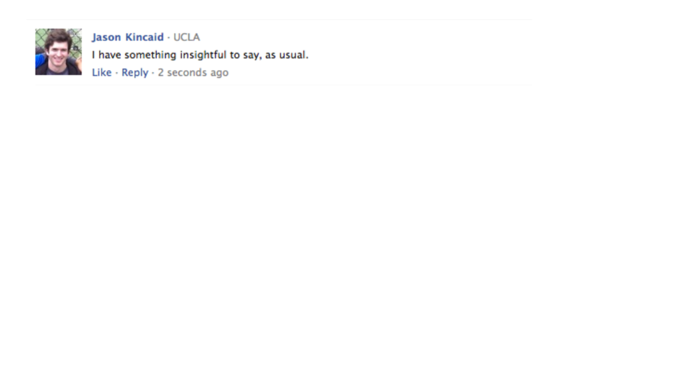
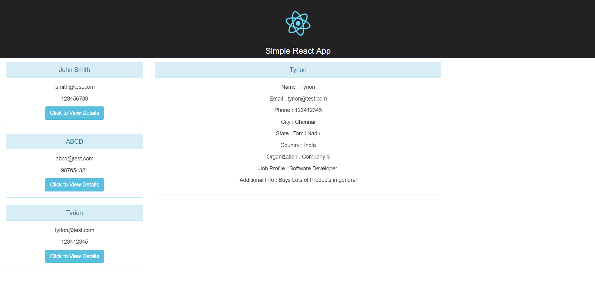
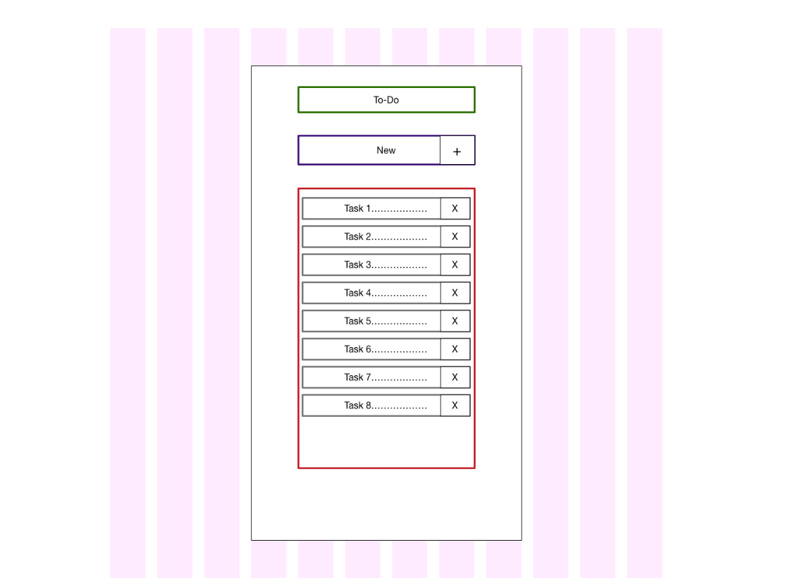
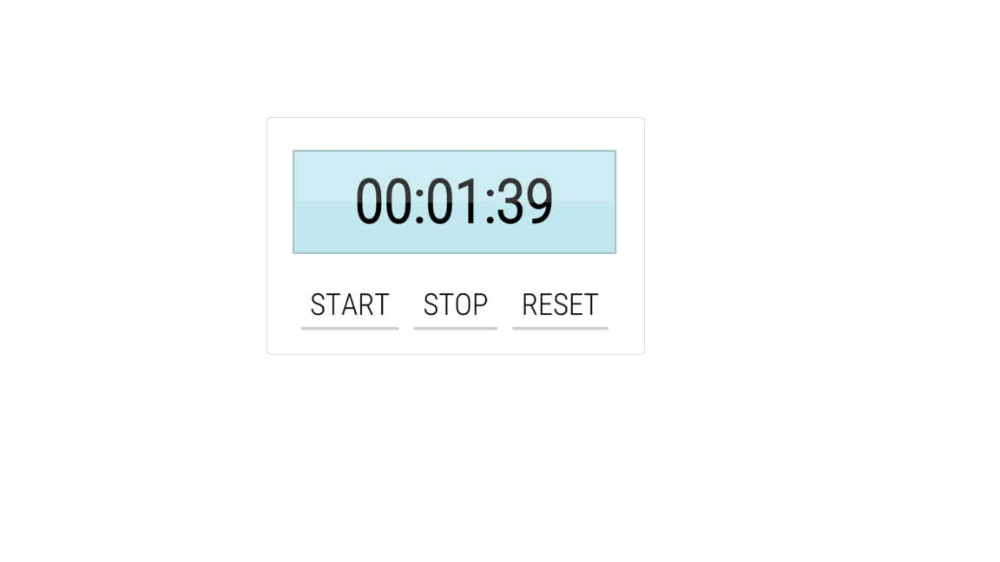

# Mini React Applications 

## Facebook Comment Card

You will make a facebook comment card as the picture below, which contain :
- profile picture 
- Profile Name 
- Comment Body 

## Simple React App
You will make a simple react apllication as the picture below, which contain :
- three cards in the sidebar.
- a display area  
- when you click on  (Click to show details) the informations will display in the display area.

## React To Do List 
You will make a simple to do list, which contain :
- a simple input field, so the user will insert the task using this input field.
- when the user click ENTER the tasks will be add below the input feild as a list. 
- when you click on the task itself the task will disappear. 
- You can follow any design you like.  

## Counter 
You will make a simple counter, which contain :
- a simple display area that display the time.
- the time will be counting down. 
- the user can start, stop and reset the counter.
- you can follow any design you want. 

